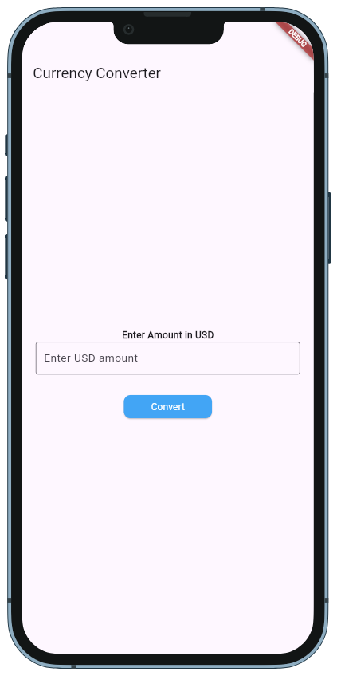
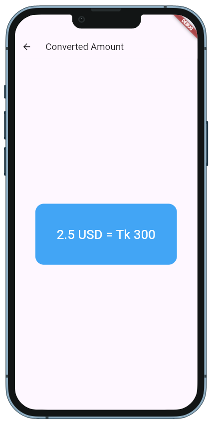

# *USD to BDT Currency Converter App*

A *Flutter-based* mobile application that allows users to easily convert USD (United States Dollar) to BDT (Bangladeshi Taka) in real time. The app provides an efficient and user-friendly interface to perform currency conversions with accuracy and speed.

# *📸 Screenshots*

## *🏡 Home Screen*

## *🏡 Result Screen*

# ✨ *Features*

- 💵 *Real-Time Currency Conversion*
- 🔢 *Convert USD to BDT and vice versa*
- 🌍 *Accurate Exchange Rate Updates*
- 🎨 *Modern & Interactive UI*
- ⚡ *State Management using GetX*
- 📣 *Snackbar for error handling*
- 🌙 *Smooth User Experience*

## 👤 Author

**Md. Shoaib**  
📧 Email: shoaibcsecu@gmail.com  
🔗 GitHub: [Md. Shoaib](https://github.com/S-h-o-a-i-b)